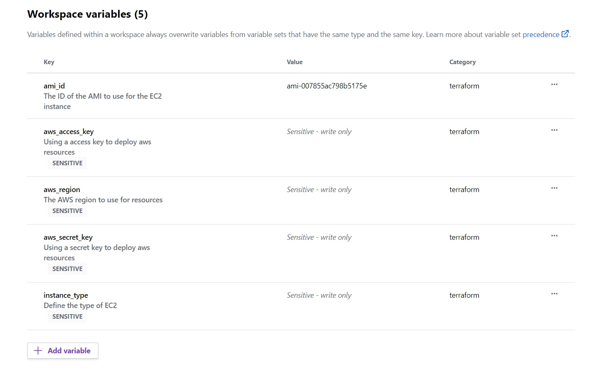
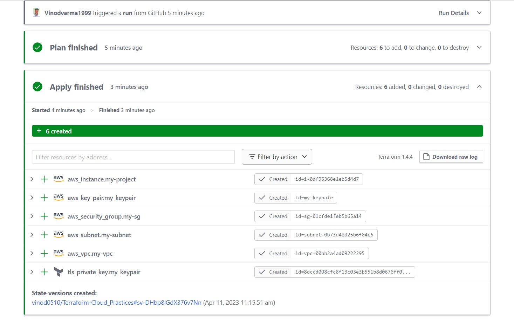

# Creating an AWS EC2 Instance with a Custom AMI using Terraform Cloud

## Follow the <i> <a href=https://medium.com/@vv279433/creating-an-aws-ec2-instance-with-a-custom-ami-using-terraform-a41f08d3c4ad> Blog </a> </i> for better understanding.

### use the variables like this:

### Output:

