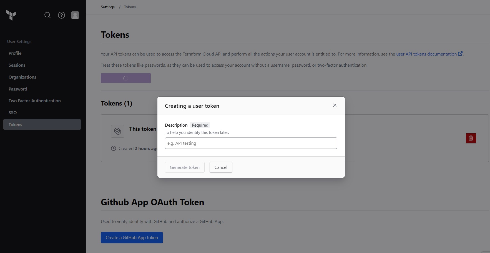
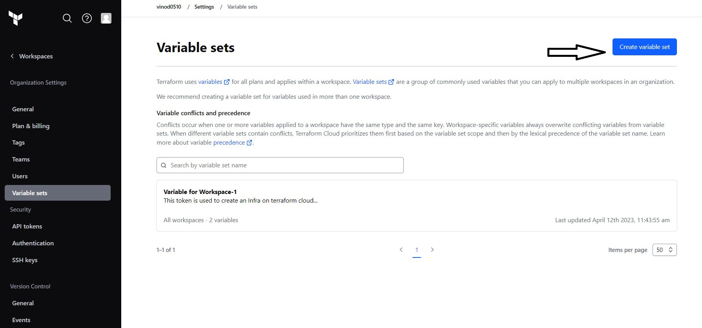
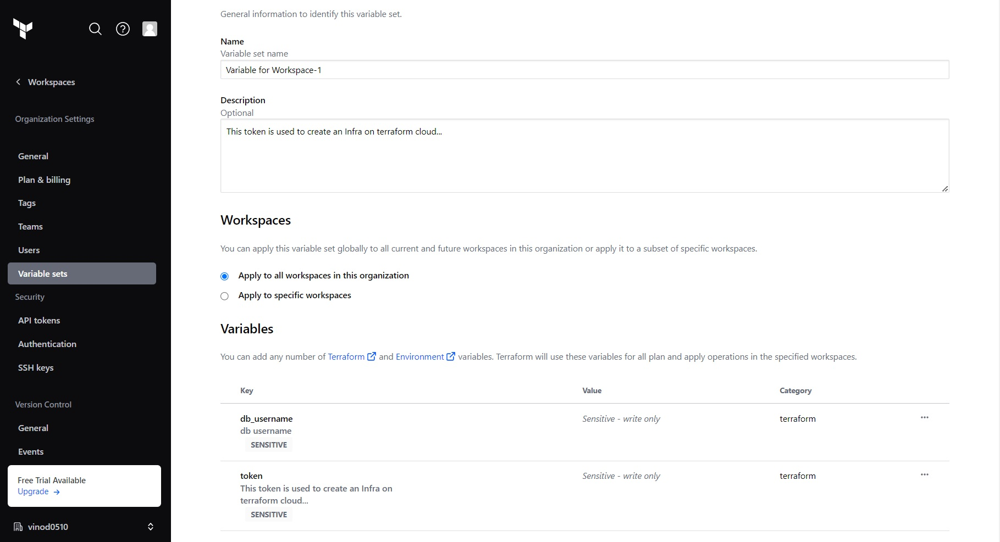
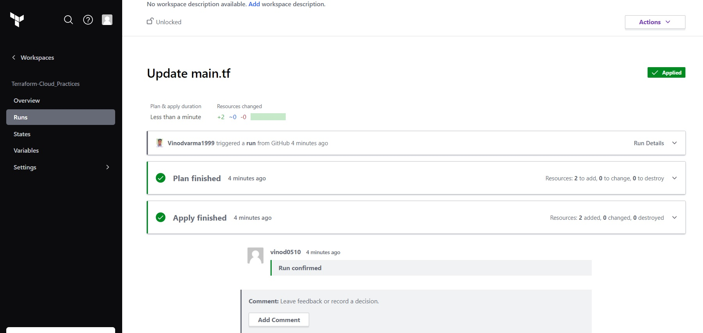

## Create a Workspace & Variable in Workspace using Terraform

### 1. Create a Cloud API token to perform a task by your github onto Terraform Cloud

### 2. go to setting --> Variable set --> Create

### 3. Store the token as an varibale on terraform Cloud.

### 4. Deployed the resource

